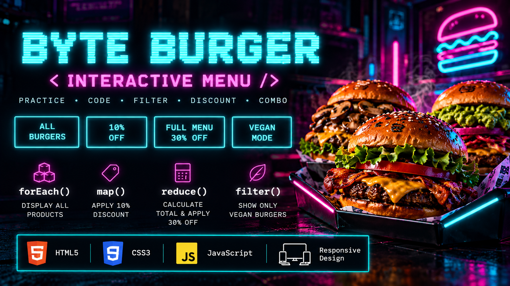

# 🍔 BYTE BURGER

> Um menu interativo de hamburgueria desenvolvido para praticar JavaScript, manipulação do DOM e métodos de array — com uma interface inspirada em arcades e estética cyberpunk.



## 🇧🇷 Português

### Sobre o projeto

**BYTE BURGER** nasceu como um projeto prático durante meus estudos de JavaScript no DevClub.

O objetivo inicial era praticar quatro métodos importantes de arrays:

`forEach()` • `map()` • `reduce()` • `filter()`

Em vez de manter apenas o layout original do exercício, decidi transformar o projeto em algo com identidade própria, criando uma interface inspirada em **arcades retrô e estética cyberpunk**, além de adicionar responsividade, imagens personalizadas e algumas melhorias na experiência do usuário.

### ⚡ Funcionalidades

**[ ALL BURGERS ]**  
Exibe todos os produtos do menu utilizando `forEach()`.

**[ 10% OFF ]**  
Utiliza `map()` para criar um novo array com 10% de desconto nos preços, sem alterar os produtos originais.

**[ FULL MENU 30% OFF ]**  
Utiliza `reduce()` para calcular o valor total do menu e aplica 30% de desconto ao combo completo.

**[ VEGAN MODE ]**  
Utiliza `filter()` para exibir apenas os produtos veganos.

### 🧠 Conceitos praticados

- Manipulação do DOM
- `querySelector()`
- `addEventListener()`
- Funções e parâmetros
- Arrays e objetos
- `forEach()`
- `map()`
- `reduce()`
- `filter()`
- Spread Operator (`...`)
- Template Literals
- `innerHTML`
- `toFixed()`
- CSS Grid e Flexbox
- Media Queries
- CSS Animations com `@keyframes`
- Design responsivo para desktop e mobile

### 🛠️ Tecnologias

- HTML5
- CSS3
- JavaScript
- Git
- GitHub

### 🎮 Interface

A identidade visual foi inspirada em interfaces de **arcade, terminais retrô e cyberpunk**, utilizando principalmente cyan, magenta e fundos escuros.

A tela inicial simula um terminal aguardando uma interação:

```text
> SYSTEM READY_

SELECT A MENU MODE TO CONTINUE
```

A partir daí, cada botão executa uma operação diferente sobre os dados do menu e atualiza dinamicamente a interface.

---

## 🇺🇸 English

### About the project

**BYTE BURGER** started as a practical project while studying JavaScript at DevClub.

The original goal was to practice four important JavaScript array methods:

`forEach()` • `map()` • `reduce()` • `filter()`

Instead of keeping the original exercise layout, I decided to give the project its own identity by creating a **retro arcade / cyberpunk inspired interface**, adding responsive design, custom visuals and a few improvements to the user experience.

### ⚡ Features

**[ ALL BURGERS ]**  
Displays all menu products using `forEach()`.

**[ 10% OFF ]**  
Uses `map()` to create a new array with discounted prices without modifying the original products.

**[ FULL MENU 30% OFF ]**  
Uses `reduce()` to calculate the total menu value and applies a 30% discount to the complete combo.

**[ VEGAN MODE ]**  
Uses `filter()` to display only vegan products.

### 🧠 Concepts practiced

- DOM manipulation
- `querySelector()`
- `addEventListener()`
- Functions and parameters
- Arrays and objects
- `forEach()`
- `map()`
- `reduce()`
- `filter()`
- Spread Operator (`...`)
- Template Literals
- `innerHTML`
- `toFixed()`
- CSS Grid and Flexbox
- Media Queries
- CSS animations with `@keyframes`
- Responsive desktop and mobile design

### 🛠️ Technologies

- HTML5
- CSS3
- JavaScript
- Git
- GitHub

---

## 🚀 Project status

**Completed — V1**

The project was built as part of my journey learning web development and JavaScript fundamentals.

Future improvements may be added as I continue learning new technologies.

---

### 👨‍💻 Author

**Bruno Henrique Santana**

Building projects and documenting my journey into software development.
